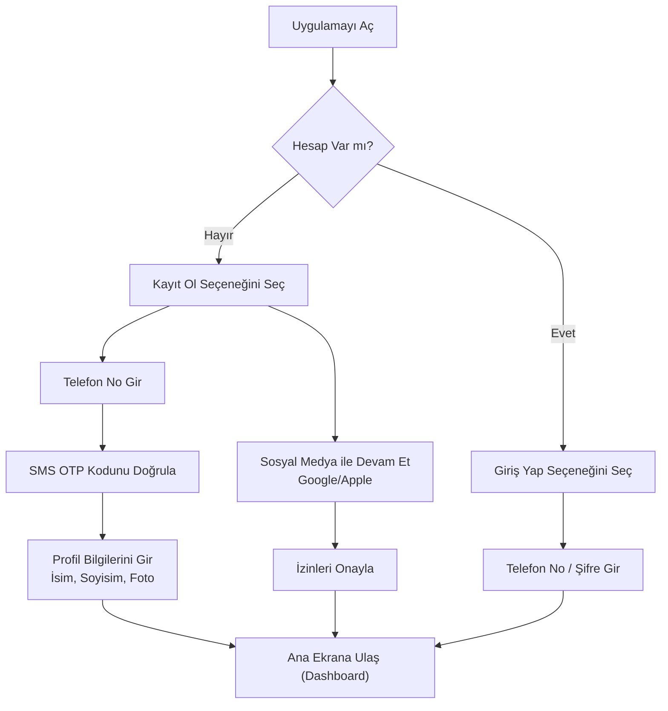
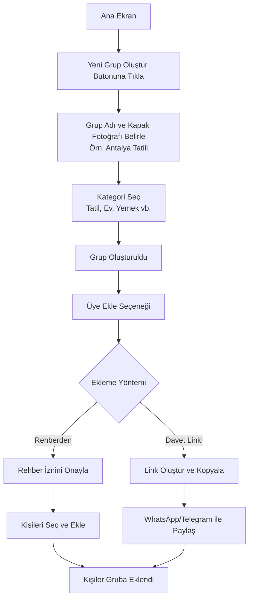
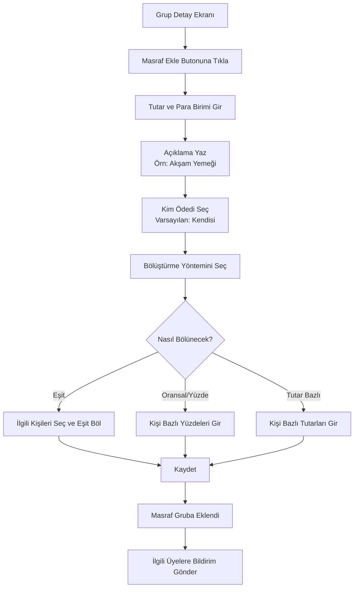
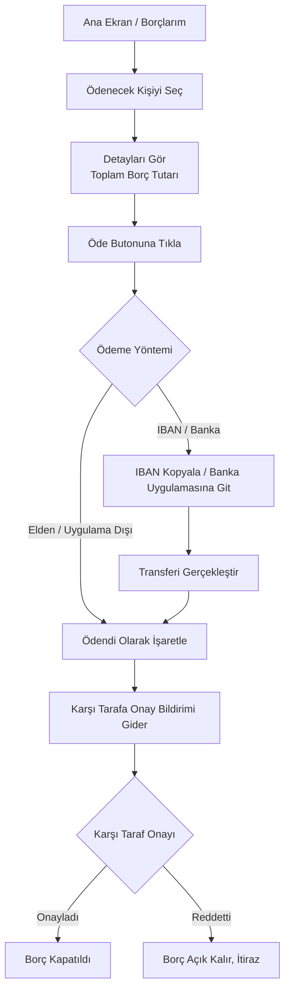

# Kullanıcı Akışları (User Flows)

Bu belge, kullanıcıların uygulama içindeki temel yolculuklarını ve etkileşimlerini görselleştirmektedir.

## 1. Uygulamaya Kayıt ve İlk Giriş Akışı

Kullanıcının uygulamayı ilk indirdiğinde karşılaştığı kayıt/giriş sürecidir.

## 2. Grup Oluşturma ve Üye Davet Akışı

Kullanıcının yeni bir etkinlik için grup oluşturması ve arkadaşlarını davet etmesi.

## 3. Masraf (Harcama) Ekleme Akışı

Bir kullanıcının grup içine yeni bir harcama girmesi.

## 4. Borç Ödeme ve Hesaplaşma Akışı

Kullanıcının borcunu ödemesi ve sistemde kapatması.

