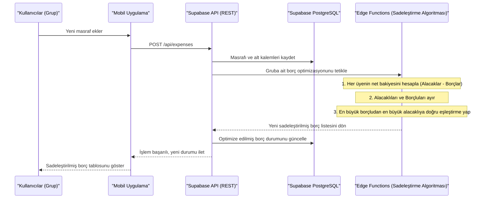
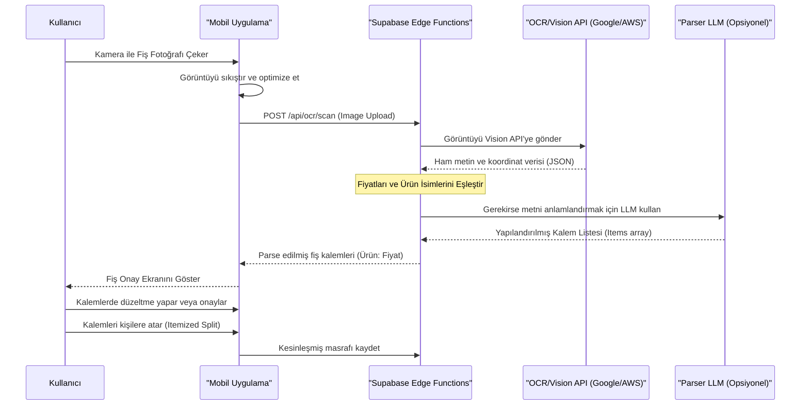
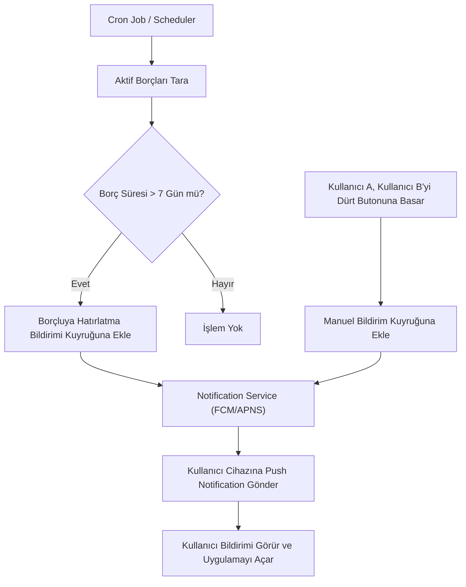

# İş Akışları (Workflows)

Bu belge, uygulamanın arka planında çalışan ve iş mantığını (business logic) oluşturan temel süreçleri tanımlar.

## 1. Borç Sadeleştirme Algoritması (Debt Simplification Workflow)

Bu sistem, grup içerisindeki tüm harcamalardan doğan karmaşık borç ağını en aza indiren optimizasyon sürecidir.

## 2. OCR ile Fiş Tarama İş Akışı (Faz 2)

Kullanıcının bir fiş fotoğrafı çekip kalem bazlı hesabın oluşturulması süreci.

## 3. Bildirim ve Hatırlatma İş Akışı

Sistemin kullanıcılara doğru zamanda bildirim gönderme süreci.

