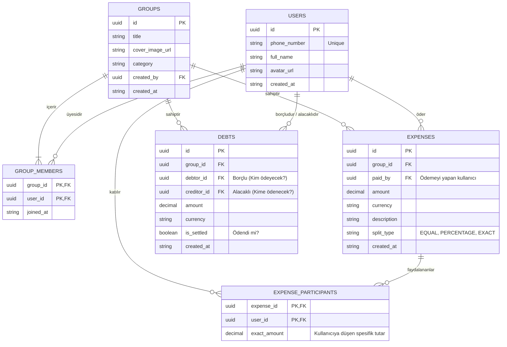

# Veritabanı Şeması (Database Schema)

Bu belge, Supabase (PostgreSQL) üzerinde kurulacak olan veritabanı tablolarını ve aralarındaki ilişkileri (ER Diagram) tanımlar.

## Temel Tablolar ve İlişkiler

Uygulamanın MVP fazı için 4 ana tabloya ihtiyaç vardır: Kullanıcılar, Gruplar, Grup Üyeleri, Masraflar (Harcamalar) ve Borçlar (Borç/Alacak durumu).

## Supabase Özellikleri ile Entegrasyon

*   **Row Level Security (RLS):** Supabase üzerinde, bir kullanıcının sadece üyesi olduğu grubun harcamalarını ve borçlarını görebilmesi için RLS (Satır Seviyesi Güvenlik) kuralları yazılacaktır.
*   **Realtime:** `EXPENSES` ve `DEBTS` tablolarına Supabase Realtime aboneliği (subscription) açılarak, bir kişi gruba masraf eklediğinde diğer kullanıcıların ekranının anında güncellenmesi sağlanacaktır.
